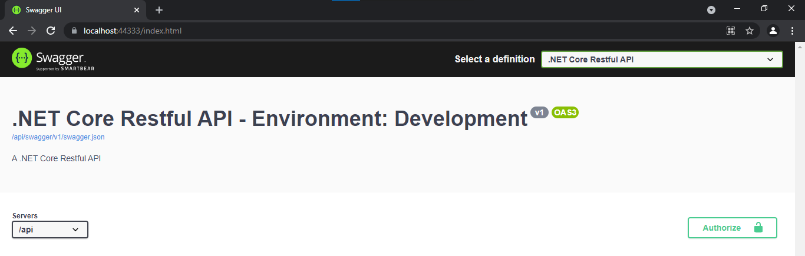

# .NET Core Restful API

## O que é o projeto?
Restful web api desenvolvida em .NET Core 3.1 para fins de exibir notícias a partir de diferente fontes de dados. Sendo estas:
- um banco de dados relacional (sql server);
- web page da Globo.

## Objetivos
- Auxiliar devs júniores no estudo de design patterns e boas práticas.

## Arquitetura
- Application: interceptação de requests e devolução de resposta http;
- Presentation: camada intermediária que prepara o formato de dados e simplifica o uso da camada de negócios pela aplicação;
- Domain: contém regra de negócios, utiliza service-repository pattern;
- Infra: realiza conexões com banco de dados (ajuda a trazer o baixo acoplamento entre código de regra de negócios e os detalhes de implementação para persistir os dados) 
- Tests: testes automatizados;

## Como instalar?
- Clone o repositório com `git clone <repo_link>`;
- Estabeleça uma conexão local do SQL Server conforme tutorial da [Microsoft](https://docs.microsoft.com/pt-br/sql/database-engine/configure-windows/sql-server-express-localdb?view=sql-server-ver15);
- Digite o comando `dotnet watch run`;

Obs: todos os passos acima pressupõem que você tem a CLI do .NET Core instalada e o SQL Server em sua máquina.

O resultado final deve ser:

